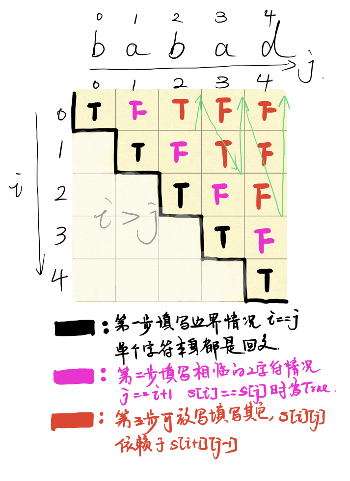
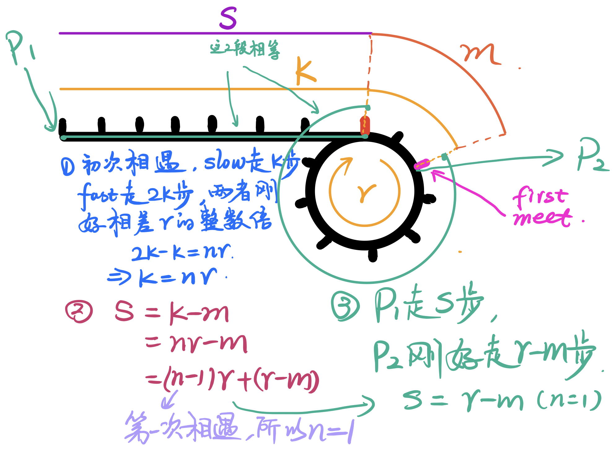
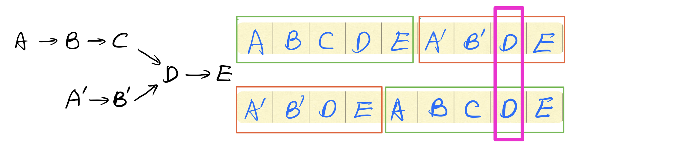
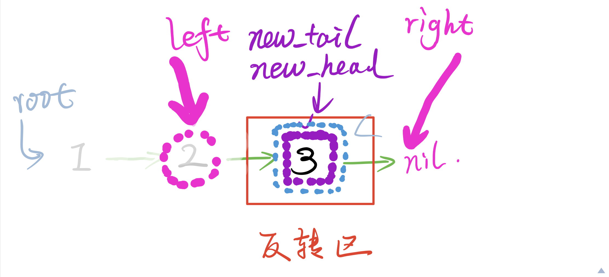
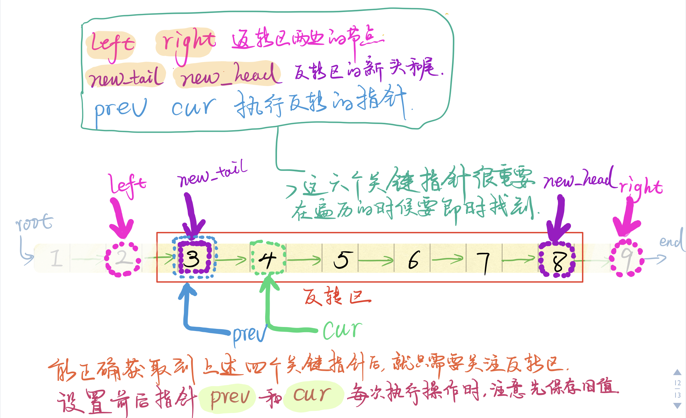
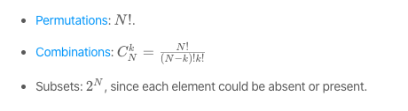
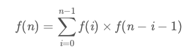

# 经验教训

* 一定要吧功能尽量细化为函数，这样一者做题思路比较清晰，二者可以在某些情况下直接return值。
* 如果输入的形式是一个序列，则可以想想：分治、动规、贪婪，一般不建议搜索，因为很费时间，栈还有可能溢出。

# 高频hard
LRU Cache
Meidan of Two Sorted Arrays
Trapping Rain Water
Integer to English Words
Regular Expression Matching
Merge K Sorted Lists
Remove Invalid Parentheses
Serialize and Deserialize Binary Tree
Minimum Window Substring

# C++ STL中常见容器的时间复杂度

* map, set, multimap, and multiset 上述四种容器采用红黑树实现，红黑树是平衡二叉树的一种。不同操作的时间复杂度近似为:
	- 插入:O(logN)
	- 查看:O(logN)
	- 删除:O(logN)

* hash_map, hash_set, hash_multimap, and hash_multiset 上述四种容器采用哈希表实现，不同操作的时间复杂度为：
	- 插入:O(1)，最坏情况O(N)。
	- 查看:O(1)，最坏情况O(N)。
	- 删除:O(1)，最坏情况O(N)。

# 奇技淫巧

* [41. First Missing Positive](https://leetcode.com/problems/first-missing-positive/)参考[My short c++ solution, O(1) space, and O(n) time](https://leetcode.com/problems/first-missing-positive/discuss/17071/My-short-c%2B%2B-solution-O(1)-space-and-O(n)-time),有2层循环，也没有证明过程，不知道对不对。

* [84. Largest Rectangle in Histogram](https://leetcode.com/problems/largest-rectangle-in-histogram/)在搜索的时候，采用了动态规划的实现个，巧妙的实现了跳跃查找，加速了查找速度。[leetcode84.png](./images/leetcode84.png)

# 搜索

很多题目其实都是一个“搜索+剪枝”的过程，其实搜索是一个非常通用的方法。任何一个最优化类型的题目，其实都可以通过搜索来解决。只是对于简单的暴力搜索来说，搜索空间是非常巨大的甚至是一个无限的空间，所谓的“优化”其实就是对搜索空间进行归纳总结，想想从哪里开始搜，搜索方向是什么，哪些子空间是可以排除在外不需要搜索的。

其中识别不需要搜索的子空间的技术，叫做剪枝。通过跳过这些子空间，来实现提升效率的目的。其实在很多问题中，问题的解空间虽然大，但是由于各种约束，真正需要搜索的可能只是其中很小一部分。

面对这种搜索问题，我们可以首先观察系统中的变量有几个，如果是2个的话，就是在一个二维平面的矩形中进行搜索，如果是三个的话，就是在一个三维空间的长方体中进行搜索。

搜索的起点呢，很多情况都是矩形的顶点或者立方体的顶点。

例如11题，寻求最大装水量，问题的目标是寻找2个杆子，使得装水量最大。这样系统中的变量就有2个，每个变量的取值范围是n，也就是解空间是一个n*n的二维空间。我们需要在这个二维空间上面进行搜索。经过仔细观察，我们可以发现把l和r对调后其实是一个重复的问题，这样解空间就缩小为原来的一半，再经过观察，就可以找到搜索的路径可剪枝的方案。

# 数组

## 总结

* 看到有序数组，就可以想想二分法。下面是一个二分法的模版

```cpp
00 function binary_search(A, n, T) is
01     L := 0
02     R := n ? 1
03     while L ≤ R do
04         m := floor((L + R) / 2)
05         if A[m] < T then
06             L := m + 1
07         else if A[m] > T then
08             R := m - 1
09         else:
10             return m
11     return unsuccessful
```

二分法的几个关键点：

* 搜索边界：搜索边界一般是`[)`或者是`[]`，但是强烈推荐`[]`。因为这样算出来的mid不会是越界。

* 背靠背原则
	- 如果找到target，则在循环中就会退出。
	- 如果找不到，则会走到循环外，此时此刻，left、right的状态一定是`]``target``[`。其中right指向的是比target小的数字里面最大的，而left指向的是比target大的数字里面最小的。这一点很有用。`][`很像两个扩考背靠背，所以叫背靠背原则。

* [34. Find First and Last Position of Element in Sorted Array](https://leetcode.com/problems/find-first-and-last-position-of-element-in-sorted-array/)

二分搜索

* [74. Search a 2D Matrix](https://leetcode.com/problems/search-a-2d-matrix/)

二分搜索，重点考察找不到的情况。考察背靠背。

## Ksum问题

Ksum问题属于[Subset sum problem](https://en.wikipedia.org/wiki/Subset_sum_problem)问题的一种特殊情况。`Subset sum problem`的基础问题可以用动态规划的方法来求解。其本质是一个简化的01背包问题，只不过没有最优化的要求，只需要刚好把容量为N的背包放满即可。
在基础问题之上，可能会添加一些新的约束：
* 要求刚使用K个物品放满：Ksum问题
* 物品是否有重复，结果要求没有重复

* [1. Two Sum](https://leetcode.com/problems/two-sum/)
	- 方法1:使用哈希,能算出所有的情况
	- 方法2:双指针,只能算出一种情况
* [15. 3Sum](https://leetcode.com/problems/3sum/)
	- 返回一个解即可，元素无重复
	- 返回所有解，元素无重复
	- 返回一个解即可，元素无重复
	- 返回所有解，元素有重复


# 回溯

* [51. N-Queens](https://leetcode.com/problems/n-queens/)
N皇后问题，回溯即可。
* [79. Word Search](https://leetcode.com/problems/word-search/)

# 字符串

# 动态规划

动态规划的基本方法：
动态规划的思路是 ***假设我已经知道了目前的最优解，那么如果我在目前的情况上增加一个，那么如果通过目前的最优解求出增加后新的最优解呢？***

* 以我结尾，沆瀣一气或者自成一派大法
* 从前面抢n个大法
* 背包思路-后缀遍历大法
* 从差分下手

在做动态规划问题时，需要注意：
* 首先考虑边界，表格中的边界单元格，一定要单独起for循环填写，这样思路最清晰

## Top50动态规划问题
from [https://blog.usejournal.com/top-50-dynamic-programming-practice-problems-4208fed71aa3](https://blog.usejournal.com/top-50-dynamic-programming-practice-problems-4208fed71aa3)

* [Longest Common Subsequence | Introduction & LCS Length](https://leetcode.com/problems/longest-common-subsequence/)
* Longest Common Subsequence | Finding all LCS
* [Longest Common Substring problem](https://leetcode.com/problems/maximum-length-of-repeated-subarray/)
* Longest Palindromic Subsequence using Dynamic Programming
* Longest Repeated Subsequence Problem
* Implement Diff Utility
* Shortest Common Supersequence | Introduction & SCS Length
* Shortest Common Supersequence | Finding all SCS
* Longest Increasing Subsequence using Dynamic Programming
* Longest Bitonic Subsequence
* Increasing Subsequence with Maximum Sum
* The Levenshtein distance (Edit distance) problem
* Find size of largest square sub-matrix of 1’s present in given binary matrix
* Matrix Chain Multiplication using Dynamic Programming
* Find the minimum cost to reach last cell of the matrix from its first cell
* Find longest sequence formed by adjacent numbers in the matrix
* Count number of paths in a matrix with given cost to reach destination cell
* 0�C1 Knapsack problem
* Maximize the Value of an Expression
* Partition problem | Dynamic Programming Solution
* Subset Sum Problem
* Minimum Sum Partition Problem
* Find all N-digit binary strings without any consecutive 1’s
* Rod Cutting Problem
* Maximum Product Rod Cutting
* Coin change-making problem (unlimited supply of coins)
* Coin Change Problem (Total number of ways to get the denomination of coins)
* Longest Alternating Subsequence Problem
* Count number of times a pattern appears in given string as a subsequence
* Collect maximum points in a matrix by satisfying given constraints
* Count total possible combinations of N-digit numbers in a mobile keypad
* Find Optimal Cost to Construct Binary Search Tree
* Word Break Problem | Dynamic Programming
* Word Break Problem | Using Trie Data Structure
* Total possible solutions to linear equation of k variables
* Wildcard Pattern Matching
* Find Probability that a Person is Alive after Taking N steps on an Island
* Calculate sum of all elements in a sub-matrix in constant time
* Find Maximum Sum Submatrix in a given matrix
* Find Maximum Sum Submatrix present in a given matrix
* Find maximum sum of subsequence with no adjacent elements
* Maximum Subarray Problem (Kadane’s algorithm)
* Single-Source Shortest Paths ― Bellman Ford Algorithm
* All-Pairs Shortest Paths ― Floyd Warshall Algorithm
* Pots of Gold Game using Dynamic Programming
* Find minimum cuts needed for palindromic partition of a string
* Maximum Length Snake Sequence
* 3-Partition Problem
* Calculate size of the largest plus of 1’s in binary matrix
* Check if given string is interleaving of two other given strings


### 记忆化搜索，缓存

* [303. Range Sum Query - Immutable](https://leetcode.com/problems/range-sum-query-immutable/)
频繁获取区间和，不如存一个累加和序列，到时候减法一下就可以了。

* [304. Range Sum Query 2D - Immutable](https://leetcode.com/problems/range-sum-query-2d-immutable/) 就是一个简单备忘录算法，提前算好

* [746. Min Cost Climbing Stairs](https://leetcode.com/problems/min-cost-climbing-stairs/) 
简单题目，数组递推

* [650. 2 Keys Keyboard](https://leetcode.com/problems/2-keys-keyboard/)

如果n为素数，那么只能通过把A拷贝，再复制n-1次来形成n个A，这样一共需要n次操作。

如果n为合数，就可以通过多个方式来生成n个A。比如12，可以先通过3次操作生成3，再通过4次操作，整体复制AAA再粘贴3次来生成12个A。也就是12的任何一对因子A、B都是一种合法可行的操作，既可以先生成A再通过一次复制B-1次粘贴生成n，也可以先生成B再通过1次复制A-1次粘贴生成n。至于那种方式最好，这个就要遍历一下取min。举例60来说：

```
init  dp[60] = 60
check dp[60] = dp[2] + 30 = 2 + 30 = 32
check dp[60] = 2 + dp[30] = 2 + 10 = 12
check dp[60] = dp[3] + 20 = 3 + 20 = 23
check dp[60] = 3 + dp[20] = 3 + 9 = 12
check dp[60] = dp[4] + 15 = 4 + 15 = 19
check dp[60] = 4 + dp[15] = 4 + 8 = 12
check dp[60] = dp[5] + 12 = 5 + 12 = 17
check dp[60] = 5 + dp[12] = 5 + 7 = 12
check dp[60] = dp[6] + 10 = 5 + 10 = 15
check dp[60] = 6 + dp[10] = 6 + 7 = 13
```

* [124. Binary Tree Maximum Path Sum](https://leetcode.com/problems/binary-tree-maximum-path-sum/)DFS+动态规划
	- dfs负责计算每个节点的“以我为结尾”的最大值，有三个来源
		- 只有我自己
		- 左子树+我自己
		- 右子树+我自己
	- 与此同时，需要时刻更新一个最终结果，有两个来源
		- 以我为结尾的最大值
		- l结尾+我自己+r结尾连成的路径


* [42. Trapping Rain Water](https://leetcode.com/problems/trapping-rain-water/) `高频hard`
	- 模拟思路：这个也是我一开始的思路，类似于一根一根搭建柱子的过程，每个柱子也一个单位一个单位的修。当柱子高度为0个单位时候，最大接水量就是dp[ i-1 ][ 最高单位 ]。每次增加一个单位，就要查询自己左侧最近的同等高度的单位有多远，从而增加这个单位带来的增量。具体还有几个优化的地方。
	- 顶水思路：就是Solution里面的暴力思路，是一个完全不一样的思路。切入角度是，***计算每个柱子上方最多能顶多少水***，这样子思路就更加简单了。从左到右一次遍历每根柱子的顶水量，最后相加。至于每个柱子的顶水量，取决于这个柱子左侧最高的柱子与右侧最高的柱子，这2个柱子中比较低的，决定了最高水位，这个最高水位将去柱子的高度，就是这跟柱子的顶水量。
	- 顶水思路优化：依然是计算顶水量，但是每处理一个柱子时后，计算left_max和right_max是都要O(n)扫一次。这个地方可以通过dp思想一次行算出所有的。先从左到右依此算出left_max，再从右到左算出right_max


### 子序列最值( 我结尾，沆瀣一气？或者另起炉灶)
给定一个序列，求这个序列里面的一个子序列，使得这个子序列在给定条件上是最优的

* [718. Maximum Length of Repeated Subarray](https://leetcode.com/problems/maximum-length-of-repeated-subarray/)最长公共子串（以我结尾大法）

* [1143. Longest Common Subsequence](https://leetcode.com/problems/longest-common-subsequence/)
	- 如果A[ i ] = B[ j ], i、j之前的结果肯定是dp[ i-1 ][ j-1 ] + 1
	- 否则的话，就是dp[ i-1 ][ j ]和dp[ i ][ j-1 ]这两个结果中的最大值。

* [14. Longest Common Prefix](https://leetcode.com/problems/longest-common-prefix/) 最长公共前缀，使用Trie解决。

* [792. Number of Matching Subsequences](https://leetcode.com/problems/number-of-matching-subsequences/) 判断是不是子序列

* [209. Minimum Size Subarray Sum](https://leetcode.com/problems/minimum-size-subarray-sum/) 如果你已经知道了nums[0..i]里面最短的子串长度是k，那么如何能知道nums[0..i+1]中最短的子串呢。新加入的第i个数字，可以另起炉灶（如果自己就大于s），或者跟前面的沆瀣一气。关键是如果沆瀣一气的话，需要跟前面多长的字符串沆瀣一气呢？这就需要能在O(1)时间内查到跟前面k个数字沆瀣一气能达到的效果。[209填表过程](./images/leetcode209.png)

* [53. Maximum Subarray](https://leetcode.com/problems/maximum-subarray/)
* [152. Maximum Product Subarray](https://leetcode.com/problems/maximum-product-subarray/) 注意负负得正，所以需要一个min_res和一个max_res，最终的结果，可能是下面情况中的一种。
   - nums[ k ]，重新开始另起炉灶
   - nums[ k ] * max_res[ k - 1 ]
   - nums[ k ] * min_res[ k - 1 ]

* [300. Longest Increasing Subsequence](https://leetcode.com/problems/longest-increasing-subsequence/)
依然是如果以i结尾的话，需要遍历之前所有比i小的（可以构成递增序列），看看他们最长能构成多长的序列n，加上第i个，就是n+1，选出一个最大的，就是res[i]的结果。

* [368. Largest Divisible Subset](https://leetcode.com/problems/largest-divisible-subset/)
先排序，然后对于每个i，编译[ i-1, 0 ]的所有元素，如果能整除，那就计算如果纳入这个集合，会获取多大的收益，最后res[i]的值是收益最大的那个。

* [673. Number of Longest Increasing Subsequence](https://leetcode.com/problems/number-of-longest-increasing-subsequence/)

先做下面的最长递增子序列题。这个题目是升级版，要记录一下情况的个个数。

* [674. Longest Continuous Increasing Subsequence](https://leetcode.com/problems/longest-continuous-increasing-subsequence/)

`最长递增子序列` 跟`最长递增子串`对比一下，会发现什么？
字串因为是连续的，所以只需要检查，另起炉灶？还是跟i-1沆瀣一气。
但是子序列因为没有了连续的要求，不但要考虑是否能和i-1沆瀣一气，还得考虑能不能和i-2、i-3、i-4...0等等沆瀣一气能达到更好的效果。

* 最长递增子串

```golang
func findLengthOfLCIS(nums []int) int {
	if len(nums) == 0 {
		return 0
	}
	result := make([]int, len(nums))
	result[0] = 1
	for i := 1; i < len(result); i++ {
		result[i] = 1
		for t := i - 1; t >= 0; t-- {
			if nums[i] > nums[t] {
				if result[t]+1 > result[i] {
					result[i] = result[t] + 1
				}
			}
		}
	}
	max := 0
	for _, v := range result {
		if v > max {
			max = v
		}
	}
	return max
}
```

* [740. Delete and Earn](https://leetcode.com/problems/delete-and-earn/)

不是直观的序列问题，但是可以转化为序列问题
首先把所有的数字排序，并且得到每个数字的sum得分。
没有出现的数字按照0来处理。
然后问题就转化为了，不能拿相邻的数字，如何拿最优？
解法依然是如果没有拿第i个，那result[ i ]就是result[ i-1 ],如果拿了，就是result[ i-2 ] + value[ i ]


* [801. Minimum Swaps To Make Sequences Increasing](https://leetcode.com/problems/minimum-swaps-to-make-sequences-increasing/) 特点是A、B两个数组长度相同，而且只能交换相同位置的元素。例如

```
0   1   2   3   4
------------------
0   1   6   8   10
0   4   4   5   9
```
其实思路是一样的，都是固定结尾大法。不但要算出以`i`结尾的子问题解，还要算出以`交换后的i`结尾的子问题解。设想一下上面的例子，当i==2时，要算出以6｜4结尾的解，也就是AB解，也要算出以4｜6结尾的解，也就是BA解。

怎么算AB解呢？如果A[ i ]和B[ i ]都是递增的，那么理所当然AB[ i ] 可以取值AB[ i-1 ]。
如果A[ i ]和B[ i ]相对于B[ i-1 ]和A[ i-1 ]是递增的，那么可以取值BA[ i-1 ]
所以最终解就是min(AB[ i-1 ], BA[ i-1 ])

算BA解的原理其实是相同的，只不过因为是BA解，所以自生已经swap了一次，所以结果是
min(ends_with_AB[ i-1 ]+1, ends_with_BA[ i-1 ]+1)

这类型问题需要通过2步来求解:

* 第一步：序列中以s[ k ]结尾的子序列的最优解，注意：意思是这个子序列的最后一个元素一定要是s[ k ]
* 第二部：在所有以0、1、2、3、...n结尾的解中，求max或者min，从而得到原始问题的最终解。

* [416. Partition Equal Subset Sum](https://leetcode.com/problems/partition-equal-subset-sum/)

是否能把一个集合分成两个sum相同的集合？如果原始集合的sum不能被2整除，那必然是不行的。
如果能被2整除，那么只能说有可能，现在的问题就变成了：能否从集合中挑出几个数字，刚好和为target = sum/2。
分析思路是这样的：如果已经知道了从nums[ 0 .. i-1 ]这些元素可以组成target, 那么如何能确定nums[ 0 .. i ]能否组成呢？
其实有三种情况：
- 如果nums[ i ]刚好就是target，那么肯定是能够组成的，至少只需要抛弃前面所有的，只需要一个数字就能组成。
- 如果nums[ 0 .. i-1 ]能组成，那么nums[ 0 .. i ]肯定是能组成的，大不了不用nums[ i ]
- 第三种情况比较复杂，如果nums[ i ]还差target-nums[ i ]才能组成target，而nums[ 0 .. i-1 ]刚好能组成target-nums[ i ]，那就完美了。所以，我们要计算出nums[ 0 .. i-1 ]是否能组成1-target之间的所有情况

* [55. Jump Game](https://leetcode.com/problems/jump-game/)
* [45. Jump Game II](https://leetcode.com/problems/jump-game-ii/)dp算法是O(n^2)，不是很优秀

* [403. Frog Jump](https://leetcode.com/problems/frog-jump/)
蛙跳，经典动规题目。假设我们已经知道了可以跳到第i块石头，那么如何确认能否跳到第i+1块石头呢？
首先我们跳到第i块石头的方法最多可能有i-1种一步跳的方法跳到第i块石头：从第1块到第i块、从第2块到第i块。。。从第i-1块到第i块。当然，并不是所有的情况都能跳过来的，我们仅记录那些能跳过来的情况，并且记录跳过来的步数。

好了，有了这些信息，我们就能推断出是否能从i跳到i+1了。只需要枚举从1跳过来的所有情况、从2跳过来的所有情况、从3跳过来的所有情况、、、只要一个成立，就是能跳过来。

* [413. Arithmetic Slices](https://leetcode.com/problems/arithmetic-slices/)
比较简单的动态规划，dp[ i ] == dp[ i-1 ] + 1当且仅当dp[ i ]\dp[ i-1 ]\dp[ i-2 ]能构成等差数列

### 子串选择问题

这类型题目本质上是在一个序列中挑选符合1个或者n个符合某种条件而且不重叠的子串，使得这些子串在某些条件上最优。

* [121. Best Time to Buy and Sell Stock](https://leetcode.com/problems/best-time-to-buy-and-sell-stock/) 在一个串中选择一个子串，使得这个子串的首尾差最大。在差分数组上求一个最大和。
	- 思路1：首先对数组进行差分，本质上是求差分数组sum最大的子串。经典动态规划，思想是先求出以每一个元素为结尾的串能做到的最大sum(一定要包含这个元素)。最后计算一下整体最大的元素。和最大字串参考[53. Maximum Subarray](https://leetcode.com/problems/maximum-subarray/)
	- 思路2: 首先求出一个mins，mins[ i ]表示i以及i之前最小的数字。这样计算dp[ i ] = prices[ i ] - mins[ i-1 ]

* [122. Best Time to Buy and Sell Stock II](https://leetcode.com/problems/best-time-to-buy-and-sell-stock-ii/) 在一个串中选择多个子串，使得这些子串的首尾差之差最大。在差分数组上不限次数，求最大和。
	- 思路1: 采用从`从前面抢n个大法`。时间复杂度为O(n)，不是最好的方法。
	- 思路2: 其实这道题由于可以随意买卖，所以直接将差分数列中大于0的数字相加即可获取最终的结果。

* [123. Best Time to Buy and Sell Stock III](https://leetcode.com/problems/best-time-to-buy-and-sell-stock-iii/)在差分数组上最多取2次，求最大和。这个题比较复杂，可以参考这篇文章[Best Time To Buy & Sell Stocks On Leetcode ― The Ultimate Guide](https://medium.com/algorithms-and-leetcode/best-time-to-buy-sell-stocks-on-leetcode-the-ultimate-guide-ce420259b323)

	- 思路1 ：既然是最多操作2次，那么可以可以把整个序列划分为2个部分，一共有n+1种划分方法，假设第一次操作出现在第一个部分，第二次操作出现在第二部分，那么这n+1种划分方法可以覆盖所有情况了。结下来的需求就是能快速求解dp[ l : r ]的最优操作。这个需要填写一个二维表格，每个单元的求解方法，其实就是121题的思路。所以这个问题的时间复杂度是O(n^3)空间复杂度是O(n^2)。这个思路因为空间复杂度太高，所以过不了最后一个case。
 
## 回文

* [5. Longest Palindromic Substring](https://leetcode.com/problems/longest-palindromic-substring/)
	- 切记一种常见的错误：与自己的逆转串求最长公共字串。如果一个串含有某个串k和k的逆转，那么求出来的LCS就不是回文
    - 正确的做法，动态规划:当计算dp[ i ][ j ]时，如果s[ i ] == s[ j ]而且dp[ i+1 ][j-1]==true，那么dp[ i ][ j ] = true 

* [131. Palindrome Partitioning](https://leetcode.com/problems/palindrome-partitioning/)

* [132. Palindrome Partitioning II](https://leetcode.com/problems/palindrome-partitioning-ii/)
假设前s[0:i]已经求出来了，那么新增一个字母的话，可以自己作为一个回文，这样的话，就是s[0:i-1]的切分情况，在加上把自己单独切成一个。
或者，自己可以与前1个、前2个。。。沆瀣一气（前提是能组成回文）。如果与前k个沆瀣一气的话，那那就需要用到更前面的数据。 

* [214. Shortest Palindrome](https://leetcode.com/problems/shortest-palindrome/)思路是按照5题的dp思想，求出最大的回文子串（以s[0]开头的。然后就简单了。但是需要做内存优化，滚动数组。

### 背包思路（后缀遍历大法）

01背包问题的主要思路是枚举物品和空间，从而寻找最优cost
```
F[0,0...V] <- 0
for i <- 0 to N // 枚举物品
    for v <- Ci to V  // 枚举空间
        F[i,v] <- max{F[i - 1, v], F[i - 1, v - Ci] + Wi}
```
```
F[0,0...V] <- 0
for v <- Ci to V  // 枚举空间
    for i <- 0 to N // 枚举物品
        F[i,v] <- max{F[v, i-1], F[v - Ci, i - 1] + Wi}
```

* [474. Ones and Zeroes](https://leetcode.com/problems/ones-and-zeroes/)
经典01背包问题的变种。每个字符串就是一个物品，其收益均为1，代价是里面0的个数和1的个数。由于字符串中0和1的顺序是无所谓的，所以我们吧每个字符串的代价都转化为cnt_of_zero&cnt_of_one这样的pair对。
对于代价空间，这个题目的代价空间需要一个2维度的表达，m[ cnt_of_zero ][ cnt_of_one ]。千万不要尝试吧二维的代价空间转化为一维以后用标准01背包模版来套，由于需要吧`剩余残值`转化回去，这里需要用到map，速度会很慢，会超时。

* [139. Word Break](https://leetcode.com/problems/word-break/)
依然是使用n-1、n-2、n-3、n-4...等来表示n。
res[ n ]表示目标字符串s[ 0 : n ]是不是yes。举个例子，如果我们知道s[ 0 : n-k]是yes的，恰好s[n-k+1 : n]刚好是字典里面一个单词，那么s[ 0 : n ]就是yes的。所以我们在求res[ n ]的时候，遍历字典里面所有的word，如果s[ 0 : n]刚好以word为后缀，且恰好再往前的s[0 : n - len(word) - 1]是yes的，那么res[ n ]就是yes的，否则默认是no。

* [279. Perfect Squares](https://leetcode.com/problems/perfect-squares/)
 依然使用“后缀遍历法”，通过遍历1、4、9、16等平方数字，算法至少需要几个。

* [322. Coin Change](https://leetcode.com/problems/coin-change/)
主要考虑一下amount里面最后要放硬币i的的i种情况，因为最后一定更要放，所以不考虑不放的情况。
amount就是背包的容量。

* [397. Integer Replacement](https://leetcode.com/problems/integer-replacement/)
并不是所有的可以用迭代的题目都需要用到动规。这个题目动规可以解决，但是回溯搜索的算法更快，因为i/2这个操作是二分搜索，很快就能收敛到1

* [718. Maximum Length of Repeated Subarray](https://leetcode.com/problems/maximum-length-of-repeated-subarray/) 最长公共子串，经典动态规划。填写2维表，对于所有的A [ i ]和B [ j ],result[ i ][ j ] 代表以A [ i ]和B [ j ]结尾的子字符串A [ x:i ]和B [ y:j ]最大公共重叠。如果A [ i ] = B [ j ],则保证result[ i ][ j ]至少为1，再进一步，如果result[ i - 1 ][ j - 1 ]如果大于0的话，那相当于延续之前的效果更好，即result[ i ][ j ] = result[ i - 1 ][ j - 1 ] + 1

* [39. Combination Sum](https://leetcode.com/problems/combination-sum/)

用n个数字组成一个sum，每个数字可以用无限次。这个问题就是一个无限背包问题。
在计算提及V时候1，需要计算当数字k放1次、放2次、放3次。。。等等。难点是路径记录。

* [40. Combination Sum II](https://leetcode.com/problems/combination-sum-ii/)
39题的01背包版本，但是去重比较麻烦。


## 二维动规

* [329. Longest Increasing Path in a Matrix](https://leetcode.com/problems/longest-increasing-path-in-a-matrix/) 求最长路径。这个问题是一个比较经典的二维路径动态规划问题，但是比较特殊的是，这个题目行走的方向是上、下、左、右，而不是右下。所以不存在原始的子问题，不能按照顺序求解。正确的解决方法是一直刷新result表，直到某次刷新result表没有更新为止。


* [62. Unique Paths](https://leetcode.com/problems/unique-paths/)
* [63. Unique Paths II](https://leetcode.com/problems/unique-paths-ii/)

## 解码问题

解码问题的思路都是“从前面抢几个试试”。

* [91. Decode Ways](https://leetcode.com/problems/decode-ways/)这个题目比比较有意思，但是需要注意100、0这些情况

* [93. Restore IP Addresses](https://leetcode.com/problems/restore-ip-addresses/)


### 未归类问题

* [338. Counting Bits](https://leetcode.com/problems/counting-bits/)

bit计算，如果当前是奇数，那一定是把前一个数字的最后一个bit换成了1，所以就是res[i-1]+1
如果当前是偶数，那自己的bit1的个数，肯定和自己右移一位形成的数字的bit1数是一样的。

* [357. Count Numbers with Unique Digits](https://leetcode.com/problems/count-numbers-with-unique-digits/)
对于n来说，10^n最多有n位，其中n-1位的情况已经算出来了，那就只剩下计算n位的情况了
也就是9 * 9 * 8 * 7....这么多情况

* [494. Target Sum](https://leetcode.com/problems/target-sum/)

解法依然是如果能确定dp[ : n-1 ]的话，我再加入第N个元素，看看能否通过前面的子问题来快速求解。
这个题的独特之处在于依赖的子问题不固定，子问题空间很大。 所以题目间接限制了问题的规模大小。
dp[ 0 : i ][num] = dp[0 : i-1][num - item[i]] + dp[0 : i-1][num + item[i]]

* [70. Climbing Stairs](https://leetcode.com/problems/climbing-stairs/)
简单题目


* [343. Integer Break](https://leetcode.com/problems/integer-break/)
数字拆分，使得乘积最大。解法是：每个数字都能拆分为(1,n-1)(2,n-2)(3,n-3)...(L,R)
其中最大值可能是四种情况中的一种： 
	- L * R    
	- L拆 * R
	- L * R拆
	- L拆 * R拆 

* [198. House Robber](https://leetcode.com/problems/house-robber/)
考虑当前这家，max(抢，不抢)

* [337. House Robber III](https://leetcode.com/problems/house-robber-iii/)
原理差不多，只不过第i层要访问到i+1层和i+2层的信息，所以每次递归返回时也同时携带自己下一层的信息。

* [96. Unique Binary Search Trees](https://leetcode.com/problems/unique-binary-search-trees/)
这个题的划分比较复杂。考虑到计算{1 ~ n}构成的BST的个数，对于动态规划的，我们必须通过{1 ~ n-1}、{1 ~ n-2}、{1 ~ n-3}来表达{1 ~ n}？

```
   1         3     3      2      1
    \       /     /      / \      \
     3     2     1      1   3      2
    /     /       \                 \
   2     1         2                 3
```

就拿n=3来说，可以用仔细看可以发现从1-3，每一个节点都可以作为root节点。
当确定root节点以后，左边有L个节点，右边有R个节点，其中L和R的关系是`L + R = n-1`。
其中左边的所有节点是连续的，所以有res[ L ]种情况，同理右边也是连续的R个数，所以有res[ R ]种情况。
那么以这个数字为root时候，就有res[ L ] * res[ R ]种情况。

* 当root = 1时，左边有root - 1 = 0个节点，右边有n - root = 2个节点，所以有res[ 0 ] * res[ 2 ] = 2种情况。
* 当root = 2时，左边有root - 1 = 1个节点，右边有n - root = 1个节点，所以有res[ 1 ] * res[ 1 ] = 1种情况。
* 当root = 3时，左边有root - 1 = 2个节点，右边有n - root = 0个节点，所以有res[ 2 ] * res[ 0 ] = 2种情况。

所以一共有 2 + 1 + 2 = 5种情况。
其实这个题目考的是卡特兰数。


* [32. Longest Valid Parentheses](https://leetcode.com/problems/longest-valid-parentheses/)
这个题一开始用二维动规来计算i-j是否为匹配的，然后算个整体最大。发现用二维数组就内存超，用map就时间超。

原来正规的思路是：
```
if s[i]=='(' the dp[i] must be 0.
else if s[i] == ')', there is two case:

case 1: s[i-1] == '('
in this case ,the s[:i] must be like -------().

if ------- is not formated ,dp[i] must be 2,
or if ------- is formated, there will be dp[i] = 2 + dp[i-2]

case 2: s[i-1] == ')'
In this case, the s[:i] must be like xy--------).
If "--------" is formated and y is '(', the dp[i] must be length(--------)+2, just dp[i] = dp[i-1] + 2

Also if substring endswith x is not zero , the dp[i] can be long to
dp[i] = dp[i-1] + 2 + dp[i-dp[i-1]-2]
```

* [72. Edit Distance](https://leetcode.com/problems/edit-distance/)[ 高频hard ]主要是思路是填写2维表格。因为在求解dp[i][j]的时候，如果两个单词的i、j这2个字符刚好相同，则不需要编辑，直接沿用dp[i-1][j-1]。否则的话就需要编辑。编辑有三种方法
	- 把希望寄托于dp[i-1][j-1]：把word1[i]替换为word2[j]。这样做使用了一次替换操作，所以dp[i][j] = dp[i-1][j-1] + 1
	- 把希望寄托于dp[i-1][j]：在word1[0:i-1]、word2[0:j]的基础上，把word1[i]这个字符删掉，所以dp[i][j] = dp[i-1][j] + 1
	- 把希望寄托于dp[i][j-1]：word1[0:i]、word2[0:j-1]的基础上，需要增加一个字符word2[j]，dp[i][j] = dp[i][j-1] + 1
在上面三种情况中，哪种代价最少，就取哪种。 这个题目是比较简单的编辑举例，如果定义替换，删除，增加的代价不同的话，那么三种情况的加数也不一样。

* [97. Interleaving String](https://leetcode.com/problems/interleaving-string/) 这道题也是字符串处理问题。跟72题有点共同之处。主要是的思路是，如果dp[a][b][c]已知，那么考虑到C的下一个字符
	- 如果这个字符和A[a]相同，并且A[0:a-1]和B[0:b]能组成C[c-1]这种情况，增加这个c下一个字符的C，是可以被表示的。
	- 如果这个字符和B[b]相同，并且A[0:a]和B[0:b-1]能组成C[c-1]这种情况，增加这个c下一个字符的C，是可以被表示的。
具体填表可参考[leetcode97.png](./images/leetcode97.png)，注意，要先把边界条件填写出来，这样dp的时候就不用考虑边界了


* [329. Longest Increasing Path in a Matrix](https://leetcode.com/problems/longest-increasing-path-in-a-matrix/) 求最长路径。这个问题是一个比较经典的二维路径动态规划问题，但是比较特殊的是，这个题目行走的方向是上、下、左、右，而不是右下。所以不存在原始的子问题，不能按照顺序求解。正确的解决方法是一直刷新result表，直到某次刷新result表没有更新为止。

* [1143. Longest Common Subsequence](https://leetcode.com/problems/longest-common-subsequence/)

- 如果A[ i ] = B[ j ], i、j之前的结果肯定是dp[ i-1 ][ j-1 ] + 1
- 否则的话，就是dp[ i-1 ][ j ]和dp[ i ][ j-1 ]这两个结果中的最大值。


# 图的遍历

130. Surrounded Regions


# 字典树 Trie

字典树最大的优势是可以快速的插入和查找字符串，而且可以按照字典顺序输出字符串，缺点是占用的空间比较大。

211是一个字典树搜索的变形，即支持模糊搜索，实现方法是把所有的可能都搜索一下。

* [211.Add and Search Word - Data structure design](https://leetcode.com/problems/add-and-search-word-data-structure-design/)

# 优势

insert and find strings in O(L) 要明显优于BST和Hash
可以直接以字典顺来输出所有词
可以很快的做前缀搜索：输入法自动完成功能

# 劣势

比较费内存，因为每个node都有一个长度为26的数组。

# 二叉树

二叉树的考点比较固定，主要有下面一些：
* 创建树
* 深度优先遍历
* 广度优先遍历 && 按层遍历
* 双树同时处理
* 二叉搜索树BST

在解决问题时，尽量寻找一下问题的答案是否有递归的性质，例如[101.Symmetric Tree](https://leetcode.com/problems/symmetric-tree)


## 深度优先遍历

这个经常用到，其中包括preorder、inorder和postorder三种遍历方法，每种遍历方法又分为递归遍历、循环遍历、和迭代器模式的遍历。
最典型的有下面这些题目，都是直接考察这方面内容。

* [94.Binary Tree Inorder Traversal](https://leetcode.com/problems/binary-tree-inorder-traversal)

* [144.Binary Tree Preorder Traversal](https://leetcode.com/problems/binary-tree-preorder-traversal)

* [145.Binary Tree Postorder Traversal](https://leetcode.com/problems/binary-tree-postorder-traversal)

* [173.Binary Search Tree Iterator](https://leetcode.com/problems/binary-search-tree-iterator)

## 广度优先遍历

广度优先遍历也叫按层遍历,[102.Binary Tree Level Order Traversal](https://leetcode.com/problems/binary-tree-level-order-traversal)这个题目是直接对按层遍历的考察。
按层遍历，的很多题目，一般需要能够识别到每一层的第一个节点和最后一个节点，需要在这些时候做一些特别的记录或者操作才能解决问题。
典型的问题有：

* [222.Count Complete Tree Nodes](https://leetcode.com/problems/count-complete-tree-nodes)

* [116.Populating Next Right Pointers in Each Node](https://leetcode.com/problems/populating-next-right-pointers-in-each-node)

* [117.Populating Next Right Pointers in Each Node II](https://leetcode.com/problems/populating-next-right-pointers-in-each-node-ii)

* [199.Binary Tree Right Side View](https://leetcode.com/problems/binary-tree-right-side-view/)

其中222比较直接一些，二另外三道题则比较间接，但是依然是用了层序遍历的思想。

## 双树同时处理

## 其他

* [331. Verify Preorder Serialization of a Binary Tree](https://leetcode.com/problems/verify-preorder-serialization-of-a-binary-tree/)

把建立树的流程走一次，如果中间不出问题，而且左后list为空，就是前序遍历结果。


# 字符串

* [43. Multiply Strings](https://leetcode.com/problems/multiply-strings/)模拟算数乘法，没什么。


# 哈希

哈希思想也是算法中的一个重要思想。哈希的主要应用有2方面：提高性能和归类。

通过构造特殊的哈希，可以快速收集相同类型的数据。典型的题目例如：

* [49.Group Anagrams](https://leetcode.com/problems/group-anagrams/)

* [128. Longest Consecutive Sequence](https://leetcode.com/problems/longest-consecutive-sequence/) 需要快速判断一个数字是不是在集合中。


# 链表

做单链表的题目，一般要考虑添加`延迟指针`

* [24. Swap Nodes in Pairs](https://leetcode.com/problems/swap-nodes-in-pairs/)两两反转链表，考察边界

* [141. Linked List Cycle](https://leetcode.com/problems/linked-list-cycle/)快慢指针

* [142. Linked List Cycle II](https://leetcode.com/problems/linked-list-cycle-ii/)


* [21. Merge Two Sorted Lists](https://leetcode.com/problems/merge-two-sorted-lists/)简单列表归并，直接管理列表不方便，最好是设置一个root

* [148. Sort List](https://leetcode.com/problems/sort-list/)列表的归并排序，最好使用一个root节点来管理列表
	- TopButtom:递归
    - ButtomTop:循环

* [61. Rotate List](https://leetcode.com/problems/rotate-list/)注意一些边界情况

* [83. Remove Duplicates from Sorted List](https://leetcode.com/problems/remove-duplicates-from-sorted-list/)

* [82. Remove Duplicates from Sorted List II](https://leetcode.com/problems/remove-duplicates-from-sorted-list-ii/)

* [92. Reverse Linked List II](https://leetcode.com/problems/reverse-linked-list-ii/)反转列表的终极杀器。


* [25. Reverse Nodes in k-Group](https://leetcode.com/problems/reverse-nodes-in-k-group/)使用ReverseBetween这个大杀器很容易就实现了

* [160. Intersection of Two Linked Lists](https://leetcode.com/problems/intersection-of-two-linked-lists/)`奇技淫巧`,注意一些边界情况，比如A和B根本不相交，或者其中一个是空



* [206. Reverse Linked List](https://leetcode.com/problems/reverse-linked-list/)

## 链表反转

* 判断反转
	- 判断是否需要反转：在给定链表的root时，在root中至少存在一个以上节点时，才需要反转，且当反转区仅有一个节点时，反转循环执行0次。
		- root == nil || root.Next == nil || root.Next.Next == nil 则不执行反转

* 六大指针，反转无损初始化 
	- `left`:		root
	- `right`:		root.Next.Next	[ 需要更新 ]
	- `new_tail`:	root.Next
	- `new_head`:	root.Next		[ 需要更新 ]
	- `prev`:		root.Next		[ 需要更新 ]
	- `cur`:		root.Next.Next	[ 需要更新 ]


* `prev`, `cur`事先保存
	- tprev, tcur := prev, cur
	- prev, cur := cur, cur.Next

链表反转的一般状态如下



做单链表的题目，一般要考虑添加`延迟指针`

* [24. Swap Nodes in Pairs](https://leetcode.com/problems/swap-nodes-in-pairs/)
两两反转链表，考察边界

# 队列

# 栈

* [155.Min Stack](https://leetcode.com/problems/min-stack/)
经典题目：可以求最小值的栈的实现

* [232. Implement Queue using Stacks](https://leetcode.com/problems/implement-queue-using-stacks/)
两个栈实现一个队列，需要用到两个栈，一个负责push，另外一个负责pop。执行push操作的时候，首先检测目前是否出于push状态，如果不是的话，就调整为push状态，然后在push。在pop的时候也是同理。

* [225. Implement Stack using Queues](https://leetcode.com/problems/implement-stack-using-queues/)
两个队列实现一个栈，需要用到两个队列，者两个队列无轮流做主队列，切换队列时候，需要current = (current + 1) % 2

* [150. Evaluate Reverse Polish Notation](https://leetcode.com/problems/evaluate-reverse-polish-notation/)

计算逆波兰式，使用递归最简单，或者使用栈+迭代，速度比较快。

* [394. Decode String](https://leetcode.com/problems/decode-string/)
重复压缩的字符串解码，用到栈。switch case大法.

* [735. Asteroid Collision](https://leetcode.com/problems/asteroid-collision/)

模拟题目，没啥意思，主要是考思路


# 位图

如果数据的范围是有限的，则可以使用位图。

* [187.Repeated DNA Sequences](https://leetcode.com/problems/repeated-dna-sequences)


* [136. Single Number](https://leetcode.com/problems/single-number/)

Explanation:
```
r = 7 ^ 3 ^ 5 ^ 4 ^ 5 ^ 3 ^ 4
```
Since XOR is associative and commutative, above expression can be written as:
```
r = 7 ^ (3 ^ 3) ^ (4 ^ 4) ^ (5 ^ 5)
  = 7 ^ 0 ^ 0 ^ 0
  = 7 ^ 0
  = 7
```

* [389. Find the Difference](https://leetcode.com/problems/find-the-difference/)

原理同上，都过一次，重复的都xor抵消了。

* [268. Missing Number](https://leetcode.com/problems/missing-number/)
原理同上，寻求抵消

* [190. Reverse Bits](https://leetcode.com/problems/reverse-bits/)
反转bit，比较简单

* [393. UTF-8 Validation](https://leetcode.com/problems/utf-8-validation/)
判断是否满足UTF-8字符串，原理比较简答，但是注意边界条件.

# 生成排列、组合、子集



* [77. Combinations](https://leetcode.com/problems/combinations/)生成组合，用累积大法可以解决，但是比较慢，因为如果算k=10的结果，就要把k=10之前的9、8、7、6.。。都要算一次。是否有next_combination

* [46.Permutations](https://leetcode.com/problems/permutations/)一次性生成全排列，方法参见[Generating Permutations and Combinations.pdf](./pdf/Generating-Permutations.pdf),Next Permutation大法也可以解决

* [47. Permutations II](https://leetcode.com/problems/permutations-ii/)有重复元素，但是要求去重，Next Permutation大法原生支持去重

* [31. Next Permutation](https://leetcode.com/problems/next-permutation/)Next Permutation大法。如果集合是线序的，那么存在“最小的”排列。而且模拟自然树的增长，是先增长低位（右侧开始）。如果低i位已经是从右向左递增了，说明这i位已经是最大的i全排列，那么想找到全局的下一个比当前大的最小排列，那只能从i右侧找到一个最小的但是比i-1位大的数字，取替换第i-1位，此时此刻相当于“进位”，所以i右面包括i的所有位也要反转一下，从而达到最小值（毕竟前面进位了）。

设想一下，整个permutation的过程，是从123456逐渐变化为654321的过程，由递增到递减。纯递减顺序的值是最大的，因为最大的数字都在高位。我们进行变化的时候，是先尝试将右侧变为递减的序列，然后慢慢扩张，直到整个序列都变成递减的。
所以，第一步就是寻找右侧的递减序列的开始点(从右往左找)，也叫“进位点”。找到以后，这个点右侧的序列是递减的，已经是最大了，这个时候想变大，只能“进位”。我们进位的时候，需要拿出进位点以及进位点右侧的一个数字来进行进位。拿哪个呢，拿比进位点前一个数字大的所有数字里面最小的，这样才能保证增量最小。然后把进位点以及右侧的数字逆序。

* [60. Permutation Sequence](https://leetcode.com/problems/permutation-sequence/)跟上面的题目一样，只是重新复习了一下

* [22. Generate Parentheses](https://leetcode.com/problems/generate-parentheses/)
***To enumerate something, generally we would like to express it as a sum of disjoint subsets that are easier to count.***
如果我们想做枚举，那么一般来说，首先要考虑的方法是用一些方便计数的并查集的和来表示。```closure number```

* [78. Subsets](https://leetcode.com/problems/subsets/)

使用位图来表示子集是一个极好的方法，连去重功能都有了。这是个错误的方法，当数据量非常大是，就不行了。
正确的方式是使用`累积组合法`，每次添加元素的时候，都和现在已经有的成果组合一下，也添加进去。这样形成最终的结果。

* [90. Subsets II](https://leetcode.com/problems/subsets-ii/)
78题中增加重复元素。
先排序，例如1、2、2、3、3。
同样还是遍历所有元素，每个元素都能对result贡献diff增量。
不同的是，如果这个元素于上个元素不同，则按照78题中的解法做。组合现有全部。
如果相同的话，其实就没必要在和前面左右的做组合了，因为上一个元素已经做了。
此时此刻，只需要与上一个元素产生的diff进行组合，形成增量。

# 排序

很多最优化问题，其实只要把目标集合进行排序，就会有迹可循。

一种特殊的字符串排序方法模式 [179. Largest Number](https://leetcode.com/problems/largest-number/)

[524. Longest Word in Dictionary through Deleting](https://leetcode.com/problems/longest-word-in-dictionary-through-deleting/)

# 贪心

贪心算法的常用工具是优先队列priority_queue：因为时刻都要取当前的最优解

unsolved[1353. Maximum Number of Events That Can Be Attended](https://leetcode.com/problems/maximum-number-of-events-that-can-be-attended/)

经典的开会问题

# 数论

## Catalan Number



* [96. Unique Binary Search Trees](https://leetcode.com/problems/unique-binary-search-trees/)
catalan问题的鼻祖，总共有n个元素，每一个元素都可以当作root节点，剩下的n-1个元素中，左边分配i个，右边分配n-1-i个。

* [22. Generate Parentheses](https://leetcode.com/problems/generate-parentheses/)

可以抽象为catalan树模型，任何一个n>0的问题，都可以表达为`(左树)右树`


# 堆

* [23. Merge k Sorted Lists](https://leetcode.com/problems/merge-k-sorted-lists/solution/)

暴力算法是每次取头节点并且求最小值。是重要维护一个头节点最小值的集合。如果用数组的话，插入时间复杂度o(1)，但是求最小值的时间复杂度是O(n)。如果用了优先队列，则虽然插入的时间队列是O(lgN)但是选出最小值的时间复杂度也是O(lgN)这样就会快很多。


